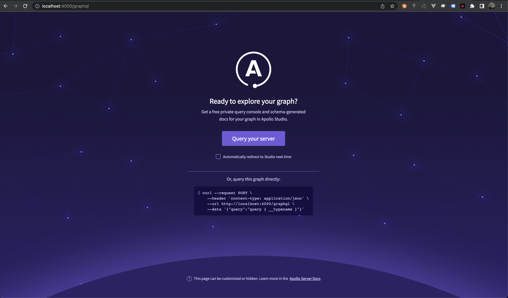
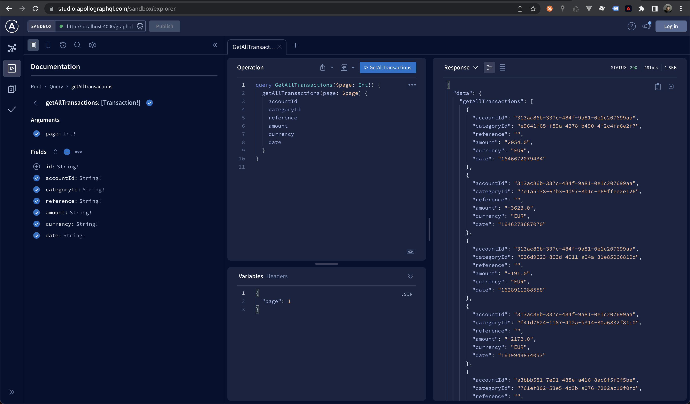

# Airbank Challenge Backend

## Development server

Run `npm install` to install dependencies 

## Setup Database

For this project I had used Postgres db running in a docker container. To make it work just run `docker-compose up -d` and then it will create a docker container using the `docker-composer-yml` file configurations.

## Run migrations

Run `npx prisma migrate dev --name "init"` to run migrations and `npx prisma db seed --preview-feature` to populate the tables. 

## Running locally

Run `npm run dev` to run the backend service with apolo graphql.It will be running on 4000 port. 
It's possible to use a playground from graphQL to test the apis, opening `localhost:4000/graphql` at the browser.

## Querys on database

Run `npx prisma studio` to open a database client at the browser 

## Screenshots

